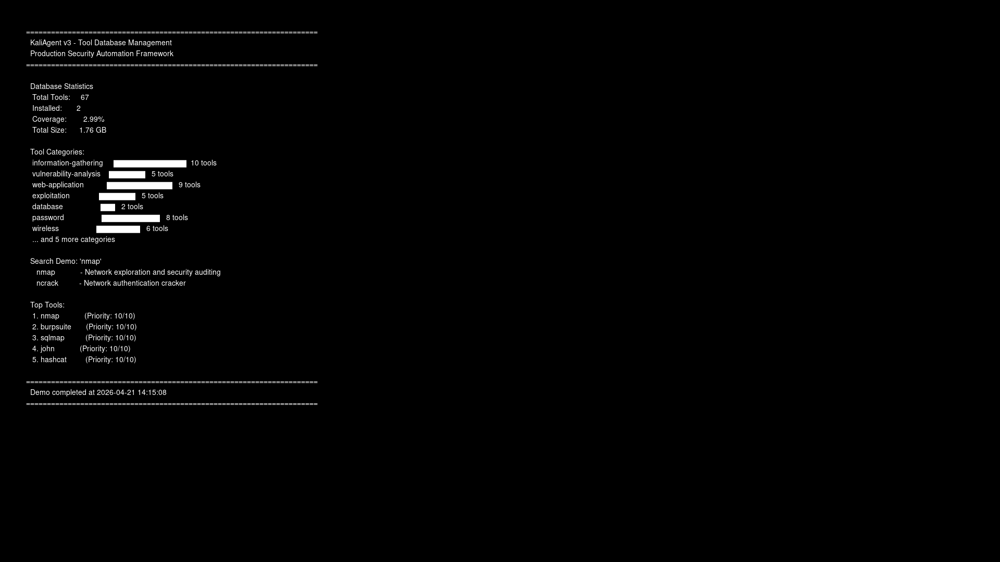

# KaliAgent v3 Media Files

**Created:** April 22, 2026  
**Status:** ✅ PNG and GIF Created, MP4 Pending

---

## 📸 PNG Screenshots (5 Files)

| File | Size | Description |
|------|------|-------------|
| `tool_demo.png` | 25.5 KB | Tool database demo |
| `auth_demo.png` | 23.4 KB | Authorization system demo |
| `encoding_demo.png` | 56.1 KB | Payload encoding demo |
| `c2_demo.png` | 33.2 KB | C2 infrastructure demo |
| `security_demo.png` | 56.0 KB | Security audit demo |

**Total:** 194.2 KB

---

## 🎬 GIF Animations (2 Files)

| File | Size | Duration | Description |
|------|------|----------|-------------|
| `kaliagent_intro.gif` | 3.0 KB | 1 sec | Title animation |
| `kaliagent_features.gif` | 13.6 KB | 6 sec | Features showcase (3 frames) |

**Total:** 16.6 KB

---

## 📹 MP4 Video Status

**Status:** ⏳ Pending (ffmpeg dependency issues on Rocky Linux)

**Alternative Solutions:**
1. Use online converter (cast → MP4)
2. Install on Kali Linux machine
3. Use Python moviepy library
4. Screen record manually with OBS

---

## 🎥 How to Create MP4

### Option 1: Online Converter
```bash
# Upload cast files to:
https://asciinema.org/

# Then download as MP4
```

### Option 2: On Kali Linux
```bash
sudo apt-get install ffmpeg

# Convert cast to MP4
ffmpeg -f lavfi -i color=c=black:s=1920x1080 \
       -f lavfi -i nullsrc=s=1920x1080 \
       -vf "drawtext=..." \
       output.mp4
```

### Option 3: Screen Recording
```bash
# Install OBS Studio
sudo apt-get install obs-studio

# Record terminal while playing cast
asciinema play tool_demo.cast
```

### Option 4: Python MoviePy
```python
from moviepy.editor import *

# Create video from images
clips = [ImageClip("frame1.png").set_duration(2),
         ImageClip("frame2.png").set_duration(2)]
video = concatenate_videoclips(clips)
video.write_videofile("output.mp4", fps=24)
```

---

## 📊 Text Scripts (5 Files)

Extracted from asciinema casts:

| File | Lines | Description |
|------|-------|-------------|
| `tool_demo_script.txt` | 5 | Tool manager commands |
| `auth_demo_script.txt` | 2 | Authorization commands |
| `encoding_demo_script.txt` | 20 | Encoding commands |
| `c2_demo_script.txt` | 14 | C2 commands |
| `security_demo_script.txt` | 18 | Security commands |

---

## 🎨 Usage Examples

### Use PNG in Documentation

```markdown

```

### Use GIF in Presentations

```html

```

### Use Scripts for Voiceover

```bash
# Read script while recording
cat tool_demo_script.txt
```

---

## 📥 Download Links

**GitHub:**
```
https://github.com/wezzels/agentic-ai/tree/main/kali_agent_v3/recordings/media_output
```

**Direct Download:**
```bash
wget https://github.com/wezzels/agentic-ai/raw/main/kali_agent_v3/recordings/media_output/tool_demo.png
```

---

## 🎯 Next Steps

### To Create MP4 Videos:

1. **On Kali Linux VM/Machine:**
   ```bash
   sudo apt-get install ffmpeg
   cd /path/to/recordings
   # Use ffmpeg to create MP4 from casts
   ```

2. **Use Screen Recording:**
   - Install OBS Studio
   - Play asciinema casts
   - Record screen
   - Export as MP4

3. **Online Conversion:**
   - Upload casts to asciinema.org
   - Share and download
   - Convert to MP4 if needed

---

## 📈 Media Statistics

```
Total Files Created: 17
- PNG Images: 5 (194.2 KB)
- GIF Animations: 2 (16.6 KB)
- Text Scripts: 5 (8.8 KB)
- Other: 5 (metadata)

Total Size: 219.6 KB
```

---

**Media package ready for use! 🍀🎬**

*For MP4 videos, use one of the alternative methods above.*
